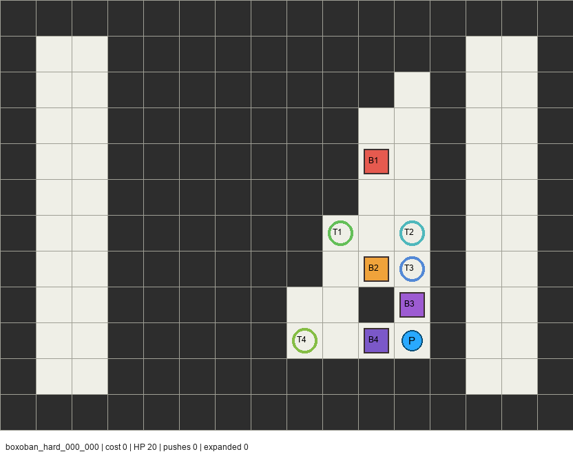
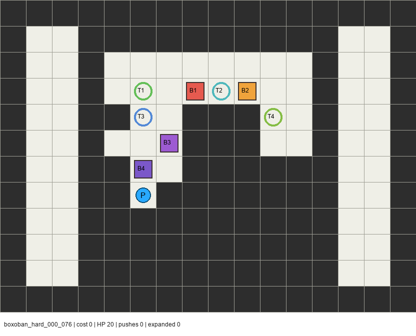
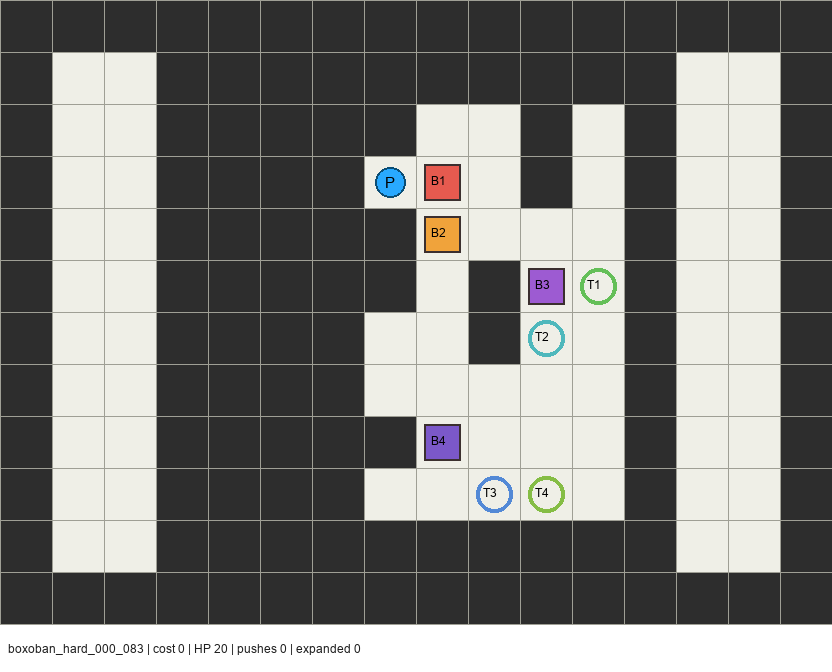
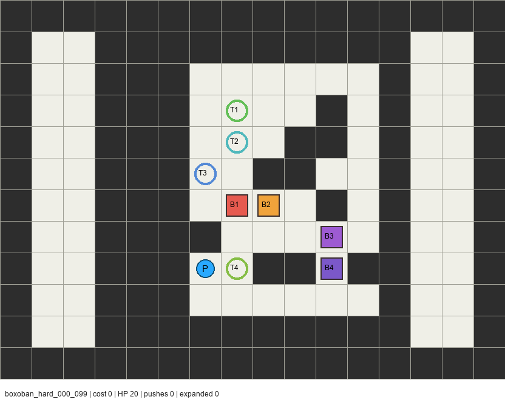
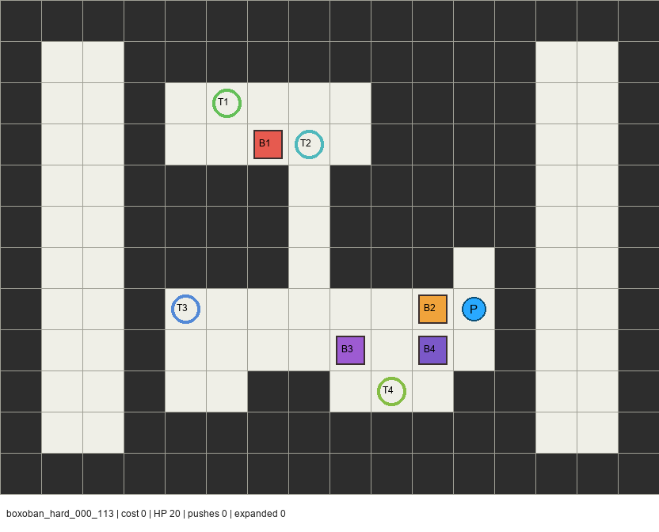

# 🚗 Smart Car Path Planner / 智能车路径规划

[](https://www.python.org/)
[](android_native/)
[](embedded/stm32f304/)
[](#)

一个面向智能车视觉赛题的 16×12 栅格路径规划项目。它把"推箱子"规则改造成更接近比赛任务的工程模型：小车有方向、箱子和目标点需要编号匹配、102/103 需要先进行视觉识别路线规划，103 还加入可推动炸弹和炸墙机制。项目同时提供 PC 端 Python 求解器、OpenCV 截图识别、Tkinter 动画演示、原生 Android 地图编辑与跑图 APP，以及 STM32F304 固件导出思路。

[Latest APK Release](https://github.com/xianshengl487-star/smart-car-path-planner/releases/latest) · [Core Logic](docs/CORE_LOGIC.md) · [Android Source](android_native/) · [STM32 Notes](embedded/stm32f304/) · [Optimization Roadmap](OPTIMIZATION_ROADMAP.md)

---

## ✨ Features / 项目亮点

| Feature | Description |
|---------|-------------|
| 🔢 **Numbered Box Planning** | `B1→T1`, `B2→T2`, `B3→T3` 一一对应，箱子到达同号目标后消失 |
| 👁️ **Vision Recognition** | 102/103 支持 OpenCV 识别阶段，先靠近编号再推箱 |
| 💣 **Bomb Mechanics** | 103 支持可推动炸弹，撞墙后爆炸清除 3×3 非边界墙 |
| 📱 **Native Android APP** | 横屏地图编辑、逐步动画、播放/暂停/快进、STM32 性能模拟 |
| 🖥️ **PC Python Solver** | A* 求解 + Tkinter 动画 + OpenCV 识别 + PNG 结果导出 |
| 🔧 **STM32 Export** | 固定数组、1 字节动作、无动态分配，适合小 SRAM 单片机 |
| 🗺️ **48+ Hard Maps** | 集成外部困难地图样本，30 分钟循环脚本持续检查 |

---

## 📸 Screenshots / 效果展示

### Hard Maps — High-Difficulty Examples / 困难地图示例

<details open>
<summary>Click to expand/collapse hard map previews</summary>

| Map | Preview | Run command |
|-----|---------|-------------|
| `boxoban_hard_000_000.txt` |  | `python main.py --hard-map boxoban_hard_000_000.txt --no-gui` |
| `boxoban_hard_000_076.txt` |  | `python main.py --hard-map boxoban_hard_000_076.txt --no-gui` |
| `boxoban_hard_000_083.txt` |  | `python main.py --hard-map boxoban_hard_000_083.txt --no-gui` |
| `boxoban_hard_000_099.txt` |  | `python main.py --hard-map boxoban_hard_000_099.txt --no-gui` |
| `boxoban_hard_000_113.txt` |  | `python main.py --hard-map boxoban_hard_000_113.txt --no-gui` |

</details>

### Built-in Levels / 内置关卡

The GitHub front page now uses hard maps as the primary examples. Built-in 1/2/3 levels remain available for regression checks:

```bash
python main.py --all --no-gui
```

## 🏗️ Architecture / 系统结构

```text
.
├── planner/                  # Python A* 求解器、视觉识别、死锁剪枝、关卡定义
├── android_native/           # 原生 Android APP，含地图编辑器和 Java 规划核心
├── embedded/stm32f304/       # STM32F304 固件侧执行器说明与 C 核心
├── tests/                    # Python 单元测试、比赛截图测试、Android smoke 辅助
├── versions/                 # 优化迭代快照 (v00–v20)
├── 比赛关卡/                 # 本地比赛截图批处理输入
├── outputs/                  # 本地打包 APK、识别图、结果图、校验文件
├── hard_maps/                # 48+ 外部困难地图样本 (Boxoban)
├── main.py                   # PC 端主入口
├── map_editor.py             # PC 端 Tkinter 地图编辑器
├── export_stm32.py           # 导出 STM32 预规划动作
└── mcp_server.py             # Claude/Grok 可接入的本地 MCP 服务
```

---

## 🚀 Quick Start / 快速开始

### Prerequisites / 环境要求

- Python 3.10+ (with `opencv-python`, `Pillow`)
- (Optional) Android Studio for APK build
- (Optional) Zulu JDK 17 + Android SDK for local packaging

### Python Solver / PC 端求解

```bash
# Optional: create and activate a virtual environment first.
pip install -r requirements.txt

# Run all 3 built-in levels (no GUI)
python main.py --all --no-gui

# Run with Tkinter animation
python main.py --all --delay 80

# Run single level
python main.py --level 1 --no-gui    # Direct push (no vision)
python main.py --level 2 --no-gui    # Vision recognition
python main.py --level 3 --no-gui    # Vision + bombs
```

### Contest Screenshots / 比赛截图批处理

```bash
# Solve a single screenshot
python main.py --image "比赛关卡/example.png" --no-gui

# Batch process all screenshots under 比赛关卡/
python main.py --contest --no-gui --max-expanded 250000
```

### Hard Maps / 困难地图测试

`hard_maps/` 现在可直接作为高难度示例地图库使用，已收录 48 张经过本项目求解器验证的 Boxoban hard 关卡。推荐先试这些样例：

精选 16×12 高难示例也放在 `examples/16x12_hard/`，适合直接复制到手机端地图导入、Python 命令行或 STM32 性能模拟流程中。

| Example | Why it is useful |
|---------|------------------|
| `boxoban_hard_000_083.txt` | 高扩展节点样例，适合观察复杂搜索 |
| `boxoban_hard_000_076.txt` | 推箱次数较多，适合测试长路径回放 |
| `boxoban_hard_000_113.txt` | 高复杂度窄通道样例，适合测试剪枝 |
| `boxoban_hard_000_099.txt` | 总代价较高，适合压力测试 |

```bash
# Solve all 48+ hard maps in hard_maps/
python main.py --hard-map-all --no-gui

# Solve a single hard map by filename (relative to hard_maps/)
python main.py --hard-map boxoban_hard_000_083.txt --no-gui

# Solve a selected 16x12 example by filename
python main.py --hard-map hard_16x12_high_expand_083.txt --no-gui

# Solve a hard map by full path
python main.py --hard-map "G:\路径规划\hard_maps\boxoban_hard_000_000.txt" --no-gui

# Run hard map validation tests
python -m pytest tests/test_hard_maps.py -v

# Continuous 30-minute monitoring
python scripts/watch_optimization.py --interval-seconds 1800 --include-contest
```

### Map Editor / 地图编辑器

```bash
python map_editor.py
```

### STM32 Export / 固件导出

```bash
python export_stm32.py
# Generates: embedded/generated/stm32_plans.h
```

---

## 📱 Android APP

`android_native/` 是原生 Android 项目（不是网页封装）。

### Features / 手机端能力

- ✅ 自定义 16×12 地图
- ✅ 101/102/103 模板选择
- ✅ 手机本地运行识别路线和推箱规划
- ✅ 横屏逐格行驶动画
- ✅ 播放/暂停、单步、x1/x2/x4/x8 快进
- ✅ 地图合法性检查：边界墙、唯一 P、箱子和目标编号配对
- ✅ 动作回放校验：验证移动、推箱、箱子消失、炸弹移动和爆炸结果
- ✅ 手机全量模式：解除主要计算上限，适合优先求可行解
- ✅ STM32 性能模拟：限制扩展节点数、最大队列、动作数和运行时间
- ✅ 地图粘贴导入：可将 hard_maps/ 中的地图文本粘贴到手机端运行

### Download / 下载

- Latest Release: [smart-car-path-planner/releases/latest](https://github.com/xianshengl487-star/smart-car-path-planner/releases/latest)
- Current verified: `SmartCarPlannerNative-validated-release-20260610-0923.apk`

### Build Locally / 本地重新打包

```powershell
cd "G:\路径规划"
powershell -ExecutionPolicy Bypass -File .\package_android_app.ps1
```

### Smoke Test / 核心测试

```powershell
android_native\run_core_smoke.ps1
```

### Performance Baseline / 性能基线

| Mode | 101 | 102 | 103 |
|------|----:|----:|----:|
| strict shortest | 29 | 65 | 106 |
| stm32 relaxed | 29 | 65 | 106 |
| stm32 strict | — | — | 108 |

Latest verification: `SmokeCore 12 passed, 0 failed`, `clean assembleDebug assembleRelease` succeeded, Debug/Release APKs both pass `apksigner`.

---

## 🔧 STM32F304 Integration

STM32F304 不运行完整 Python A*，推荐流程是 PC 端先求解并导出紧凑动作表，MCU 只执行固定动作和小范围局部 BFS。

```powershell
python export_stm32.py
```

### Generated Files / 生成文件

- `embedded/generated/stm32_plans.h`
- `embedded/generated/stm32_memory_report.json`

### Firmware Usage / 固件侧使用

1. Copy `embedded/stm32f304/planner_core.c` and `planner_core.h`
2. Copy `embedded/generated/stm32_plans.h`
3. Call `pp_runner_next()` to get next fixed-size command
4. Only call `pp_bfs_path()` for local correction scenarios

### Resource Usage / 资源占用

- Max actions: `106`
- Plan data Flash: ~`272 bytes`
- Runtime RAM: ~`968 bytes`
- No `malloc`, no recursion, no Python dict, no heap allocation

---

## 🧠 Algorithm Overview

PC 端和 Android 端都围绕"方向小车 + 多箱状态"建模：

```text
state = player_pose + boxes_by_id + delivered_mask + bombs + dynamic_walls + recognized_mask
```

### Key Strategies / 主要策略

- **Outer A***: 搜索推箱、推炸弹和识别动作
- **Inner BFS**: 方向 BFS 判断小车是否能到达某个推动姿态
- **Numbered Matching**: 编号箱子使用固定目标匹配，避免普通 Sokoban 中的任意目标分配
- **Vanish Logic**: 已送达箱子用 `delivered_mask` 移除，占用判断不再把它当障碍
- **Deadlock Pruning**: 角落、墙边线、动态箱子互堵等安全规则
- **Heuristic**: 固定墙地图使用反向单箱 push-distance 启发式；炸弹仍可能改变墙体时退回安全下界
- **STM32 Simulation**: Android 受限模式用扩展节点、frontier、动作数和时间预算模拟 STM32 性能边界

---

## 👁️ OpenCV Vision Recognition

Python 端支持两种视觉入口：

- 程序生成关卡 PNG，再按 16×12 网格切块识别颜色和编号
- 批处理 `比赛关卡/` 中的比赛截图，自动忽略行列标签，只识别实际网格区域

### Recognition Strategy / 识别策略

- 黄色区域识别为箱子
- 蓝色区域识别为目标点
- 小车起点强制对齐到 `(row=5, col=1)`
- 若截图编号不可靠，先按读取顺序编号，再用小规模精确 A* 探测循环映射，最后回退到完整严格 A*

本地 7 张比赛截图当前可全部求解，批处理时间约 22 秒。

---

## 🔌 MCP Integration / MCP 接入

本地 stdio MCP 服务可供 Claude Code / Grok Build 调用：

```powershell
.\run_mcp_server.bat
```

### Exposed Tools / 暴露工具

- `list_levels` — List available levels
- `solve_level` — Solve a specific level
- `render_level` — Solve and render to PNG
- `solve_contest_folder` — Batch solve contest screenshots

### Health Check / 健康检查

```powershell
claude mcp get smart-car-planner
grok mcp doctor smart-car-planner
```

> [!IMPORTANT]
> MCP 服务能把本项目的求解能力暴露给支持 MCP 的客户端，但不能直接"操控"外部 Grok 或 Claude 窗口；是否可用取决于对应客户端是否正确安装并启用该 MCP 服务。

---

## 🧪 Verification Commands / 验证命令

```powershell
# Python syntax check
python -m compileall -q .

# All unit tests
python -m unittest discover -s tests -v

# Run all built-in levels
python main.py --all --no-gui

# Contest batch solve
python main.py --contest --no-gui --max-expanded 250000

# STM32 export
python export_stm32.py

# Android smoke test
android_native\run_core_smoke.ps1
```

### Full Android Build / 完整构建

```powershell
$env:JAVA_HOME='C:\Program Files\Zulu\zulu-17'
$env:ANDROID_HOME='C:\Users\maoyaowei\AppData\Local\Android\Sdk'
$env:ANDROID_SDK_ROOT=$env:ANDROID_HOME
& 'C:\Users\maoyaowei\AppData\Local\BlockForgeStudio\gradle\gradle-8.14.4\bin\gradle.bat' -p 'G:\路径规划\android_native' clean assembleDebug assembleRelease
```

---

## 📊 Current Status / 当前状态

这个项目已经完成从 PC 原型到手机端 APP、再到 STM32 执行模型的闭环：

| Platform | Use Case |
|----------|----------|
| **PC (Python)** | 调试算法、识别截图、生成动画和 benchmark |
| **Android** | 现场改图、横屏跑图、观察动画和模拟单片机性能限制 |
| **STM32** | 执行 PC/手机侧规划好的紧凑动作序列 |

后续优化方向记录在 [OPTIMIZATION_ROADMAP.md](OPTIMIZATION_ROADMAP.md)，包括模式数据库、双向宏搜索、安全死锁学习和嵌入式有界搜索。

更详细的算法与代码说明见 [docs/CORE_LOGIC.md](docs/CORE_LOGIC.md)。

---

## 🤖 Claude Workflow Note

本项目使用 Claude Code 作为 AI 辅助开发工具，通过 `.claude-body-control/` 目录下的 workflow 文件实现 Codex（规划/审查）和 Claude（实现/验证）的分工协作。详见 `CLAUDE_WORKFLOW.md`。
